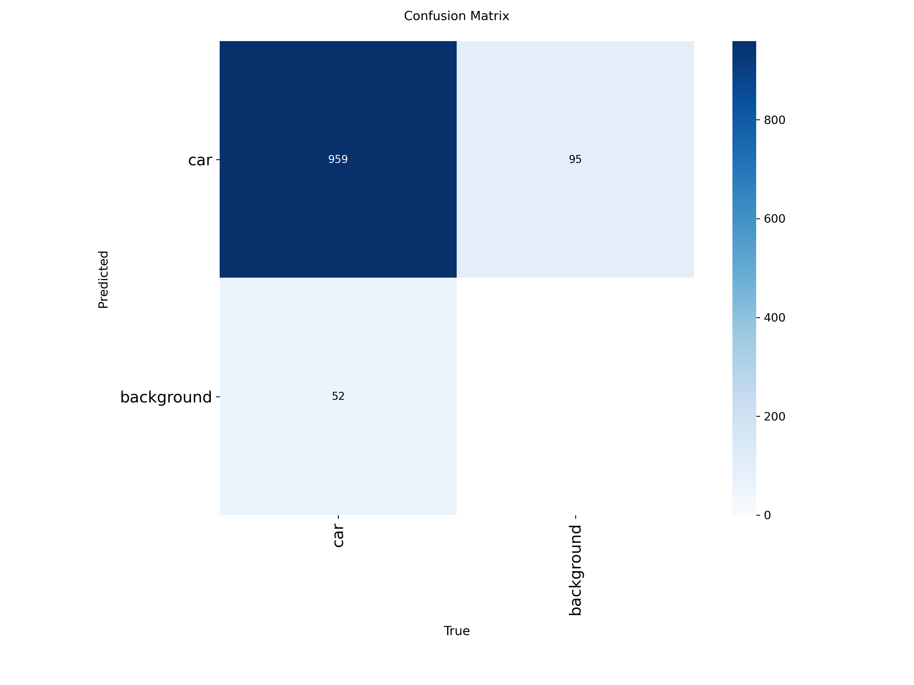
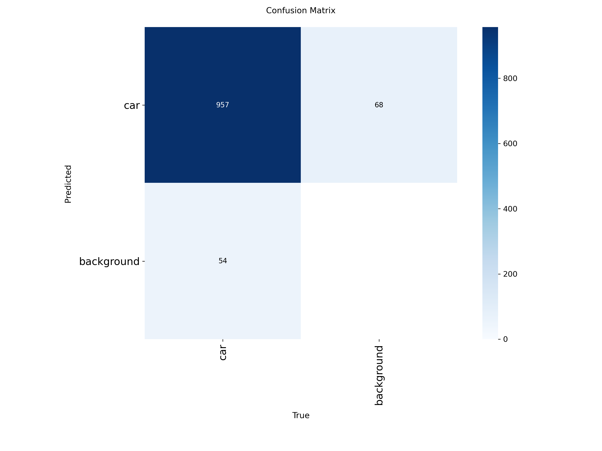

# RM 算法组第四次任务：基于 Ultralytics 框架下 YOLO26n 的目标检测
李欣怡-自动化2502-2255126012

单类别目标检测：识别图片中的机器人车（class 0 = car），输出 bbox 列表。以 yolo26n 为 baseline。


## 一、项目结构

``` 
rm_yolo26n_lxy/
├── config/
│   ├── data.yaml            # 数据集配置：path/train/val + names(0: car)
│   └── train.yaml           # 训练超参
├── src/
│   ├── common.py            # 可复用脚本：路径解析 + YOLO 标注解析 + 配置/模型加载
│   ├── data_curation/       # 数据整理脚本
│   │   ├── visualize.py     #   画框叠加图 + 统计图 + HTML 画廊
│   │   ├── filter.py        #   模糊/过暗筛选（自动筛选未采用，改人工 labelImg 复核）
│   │   ├── labelimg_prep.py #   labelImg 工作区（合并/发布）
│   │   ├── pseudo_label.py  #   伪标签生成
│   │   └── split.py         #   划分 train/val
│   ├── train.py             # 训练入口（读 config/train.yaml）
│   ├── val.py               # 验证集评估（mAP50/mAP50-95）
│   └── run.py               # 推理（输出 bbox list）
├── data/                    # 数据集（本地/云端都有，大文件 gitignored）
│   ├── labeled/{images,labels}   # 1511 张人工标注
│   ├── unlabeled/images          # 302 张未标注
│   └── pseudo05/                 # 伪标签（审查后已并入 train）
├── datasets/                # 划分结果：images/{train,val} + labels/{train,val}
├── runs/                    # 训练输出（云端）
├── weights/                 # 预训练权重 yolo26n.pt；最终结果 li_xinyi.pt；备选权重 lixinyi_backup.pt
├── README.md                # 说明文档（本文）
└── .gitignore
```

**项目实现过程中的分工说明**：
- 本地负责数据整理（可视化、labelImg 改标注、划分）。
- 云端 AutoDL（RTX 4090D）负责训练。脚本通过 `src/common.py` 的 `PROJECT_ROOT`（`__file__` 反推项目根）解析路径。
- 后续测试： clone 后无需改路径即可运行。`data/`、`datasets/`、`runs/` 等大目录已 gitignore。


## 二、环境依赖

- **本地（数据整理）**：conda `task4`（Python 3.10）+ `pillow` / `numpy` / `matplotlib`（可视化脚本依赖）+ labelImg 1.8.6（标注工具，需打补丁，见"其他问题"）。
- **云端（训练）**：conda `task4`（Python 3.10）+ PyTorch 2.5.1（CUDA 12.1）+ ultralytics 8.4.159（`pip install ultralytics`，YOLO26 已内置）。
- **测试模型**：只需 `torch` + `ultralytics`，加载 `.pt` 即可推理。


## 三、各阶段问题、决策和心得

### 1.任务需求

- 明确了只需要检测不需要分类：单类别（class 0 = car），输出 bbox 列表。评分只看模型 bbox 输出，不检查训练标注。

### 2.数据集处理

- **数据情况**：1511 张人工标注 + 302 张未标注，单类 class 0。
- **质量分析**（本地脚本分析）：**小目标为主**（75.3% 框面积 <1%、中位 0.25%）；无模糊图；36 张过暗；34%（510 张）近重复（连续视频帧，集中在编号 1200~1511）。
- **标注检查**：对已标注数据用 `visualize.py` 画框 + HTML 画廊，人工在 labelImg 里修正不紧凑的框、补漏标。
- **遮挡样本处理**：
  - 思路 1：大样本只框露出部分，小样本框带遮挡的整车；
  - 思路 2（最终采用）：**大小样本统一框带遮挡的整车**——和 val 标准一致，对提升 mAP50-95 有帮助。
- **为什么不划分测试集**：
    - val 除了早停防过拟合，已经能提供评估模型表现的指标；
    - 数据集小（1511 张），再分 test 会让训练数据更少。
- **扩充训练集**：baseline 给 302 张未标注图打伪标签（conf 0.5）→ 人工在 labelimg 检查修正 → 并入 train → 重训。即尝试了 self-training（自训练）/ 伪标签法，属半监督学习；带人工修正，比纯伪标签更可靠。

### 3.模型训练

四个模型仅 `model` / `data` / `epochs` / `name` 不同，其余一致。共享配置如下：

- **基础配置**：imgsz=1280、batch=16、device=0、workers=8、optimizer=auto（实际 AdamW lr≈0.002）
- **训练策略**：cos_lr=true（余弦退火）、lrf=0.01（学习率衰减终点 ≈0.00002）、warmup_epochs=3、mosaic 开 + close_mosaic=10（最后 10 轮关闭）、patience=15（早停）、save_period=5（每 5 轮存检查点）

汇总如下：

| 编号 | 训练配置 | 结果指标 |
|---|---|---|
| ① baseline<br>（**rm_car**） | **model**：weights/yolo26n.pt（从头）<br>**data**：1284 train / 227 val<br>imgsz 1280｜**epochs** 70｜batch 16<br>device 0｜workers 8<br>optimizer auto（AdamW lr≈0.002）<br>lrf 0.01｜cos_lr true｜warmup 3<br>mosaic 开｜close_mosaic 10<br>patience 15｜save_period 5<br>策略：COCO 预训练从头训，余弦退火 + warmup，mosaic 最后 10 轮关闭 | mAP50 0.961<br>mAP50-95 0.653<br>Precision 0.966<br>Recall 0.918 |
| ② 伪标签-微调<br>（**rm_car**） | **model**：runs/rm_car/weights/best.pt（① 微调）<br>**data**：1586 train / 227 val（含伪标签）<br>imgsz 1280｜**epochs** 50（早停@47）｜batch 16<br>device 0｜workers 8<br>optimizer auto（AdamW lr≈0.002）<br>lrf 0.01｜cos_lr true｜warmup 3<br>mosaic 开｜close_mosaic 10<br>patience 15｜save_period 5<br>策略：① 的 best.pt 微调，其余同① | mAP50 0.962<br>mAP50-95 0.656<br>Precision 0.959<br>Recall 0.918<br>漏检 52 |
| ③ 伪标签-从头<br>（**rm_car_full**） | **model**：weights/yolo26n.pt（从头）<br>**data**：1586 train / 227 val（含伪标签）<br>imgsz 1280｜**epochs** 80（早停@78）｜batch 16<br>device 0｜workers 8<br>optimizer auto（AdamW lr≈0.002）<br>lrf 0.01｜cos_lr true｜warmup 3<br>mosaic 开｜close_mosaic 10<br>patience 15｜save_period 5<br>策略：扩展后 1586 张从头训（对比②微调） | mAP50 0.961<br>mAP50-95 0.658<br>Precision 0.971<br>Recall 0.916<br>漏检 54 |
| ④ 框全部-从头<br>（**rm_car_full_v2**） | **model**：weights/yolo26n.pt（从头）<br>**data**：1586 train / 227 val（遮挡样本统一"框全部"）<br>imgsz 1280｜**epochs** 80（早停@76）｜batch 16<br>device 0｜workers 8<br>optimizer auto（AdamW lr≈0.002）<br>lrf 0.01｜cos_lr true｜warmup 3<br>mosaic 开｜close_mosaic 10<br>patience 15｜save_period 5<br>策略：在③基础上遮挡样本统一"框全部"再从头训 | mAP50 0.960<br>mAP50-95 **0.663**<br>Precision **0.972**<br>Recall 0.916<br>漏检 62 |

**指标分析和心得**：

- **imgsz 选 1280 而非 640**：本数据集以小目标为主（75.3% 框面积 <1%），640 会把目标进一步压缩到难以检测，1280 能保留足够细节。同时无需滑窗切图——切图会把一张图切成多块分别推理再拼回，推理次数翻倍、拖慢效率。
- **伪标签扩数据提升有限，但「从头训」略优于「微调」**：提升有限是因为补充的伪标签只有 302 张、占比不大，且多是模型本就能检出的"简单样本"；「从头训」优于「微调」可能是因为微调会继承 baseline 已有的偏差，而从头训练让模型均匀地重学全部数据。
- **修改遮挡样本框选策略为「框全部」能有效提高精确率，但会稍微增加遮挡车辆的漏检**：把遮挡样本统一改成"框全部"后，mAP50-95 提升（0.658→0.663），但混淆矩阵里被判断成 background 的 car 数量从 54（③）增至 62（④），说明相同置信度阈值下被遮挡目标的漏检会增加。②③④的混淆矩阵见下文。


- **optimizer 最终选用 auto**：训练日志显示 optimizer=auto 会自动选择优化器（实际用了 AdamW，lr≈0.002），并忽略 yaml 里设置的 lr0=0.01。考虑到 auto 是 ultralytics 针对 YOLO26 的推荐设置、且多轮训练结果稳定，最终保留 auto，不再手动指定优化器和学习率。
- **最终权重选择**：以 mAP50-95 为主要指标，选用 ④（rm_car_full_v2）作为主提交权重，命名为 `li_xinyi.pt`；同时考虑到 ②（伪标签微调）在验证集上 Recall 更高（0.918）、漏检更少（52），另附 ② 作为备选权重，命名为 `li_xinyi_backup.pt`，希望在内部测试集上对比两者的实际差异，为上述分析提供支撑。

### 4.其他问题

- **labelImg 闪退**：labelImg 1.8.6 太老、与 PyQt5 5.15 不兼容，滚动/缩放/画框时把浮点坐标传给了要求 int 的 Qt 接口导致闪退。打了 7 处 `float→int` 补丁（`labelImg.py` 滚动 1 + 缩放 3、`canvas.py` 画框 2、`shape.py` 文字 1）。补丁在 site-packages 里，重装会丢。
- **去重方向（已排除）**：前期尝试用 **dHash（差分哈希，把图缩成 9×8 后比较相邻像素明暗）** 判定连续帧重复并自动去重。但人工复核发现：车是小目标且在移动，dHash 判定到的是**背景的相似**，去重会误删有效样本，此优化方向无效，已作废（相关脚本已删）。
- **混淆矩阵**：

②混淆矩阵：
  
③混淆矩阵：
  
④混淆矩阵：
  
